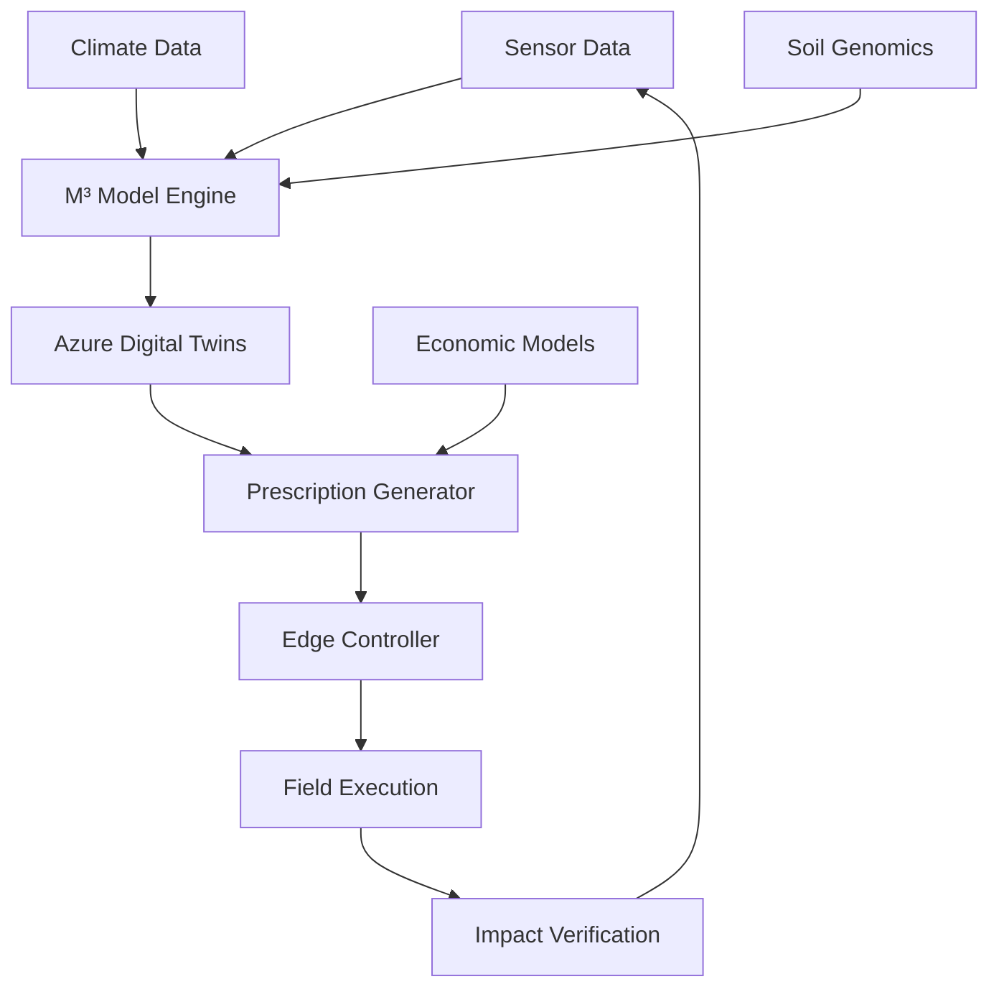

# 🌱 M³-BioSynergy: Microbial-Metabolic-Modular Theory

[](https://www.python.org/downloads/)
[](LICENSE)
[](https://github.com/shimojok/M3-BioSynergy/stargazers)

**A Novel Framework for Soil Carbon Sequestration and Regenerative Agriculture**

[](https://www.python.org/downloads/)
[](https://opensource.org/licenses/MIT)
[](https://azure.microsoft.com/)

## 🚀 Overview

M³-BioSynergy is a groundbreaking theoretical framework that models soil as a **self-organizing microbial ecosystem** capable of hyper-accelerated carbon cycling. This repository implements:

- **Microbial Dynamics**: 120-species symbiotic network modeling
- **Carbon Flow Optimization**: Predictive algorithms for carbon sequestration
- **Azure Cloud Integration**: Digital Twins, IoT, and ML implementations
- **Edge Control Protocol**: MPP (Microbial Prescription Packet) for field deployment

## 🔬 Scientific Foundation

Based on the **Ecological Hypercycle Theory** developed by Kaz Shimojo (Bionexus Holdings), this framework bridges:

1. **Complex Systems Theory** (Eigen's Hypercycles)
2. **Microbial Ecology** (120-species MBT55 consortium)
3. **Carbon Cycle Science** (Soil Organic Carbon dynamics)
4. **Digital Agriculture** (IoT, AI, and blockchain integration)

## 🏗️ Architecture


## ⚡ Quick Start

### Installation

```bash
# Clone repository
git clone https://github.com/shimojok/M3-BioSynergy.git
cd M3-BioSynergy

# Create virtual environment
python -m venv venv

# Activate virtual environment
# macOS / Linux
source venv/bin/activate
# Windows (PowerShell)
# venv\Scripts\Activate.ps1

# Install dependencies
python -m pip install --upgrade pip
python -m pip install -r requirements.txt
```

### Basic Usage

```python
from src.core.microbial_dynamics import MicrobialEcosystem
from src.core.carbon_flow import CarbonSequestrationModel

# Initialize ecosystem model
ecosystem = MicrobialEcosystem(n_species=120)
ecosystem.load_mbt_parameters()

# Run simulation (24h)
results = ecosystem.simulate(
    initial_conditions={
        "C": 100.0,  # kg C
        "N": 10.0,   # kg N
        "P": 5.0     # kg P
    },
    duration_hours=24,
    intervention_level=1.0
)

# Calculate carbon impact
carbon_model = CarbonSequestrationModel()
impact = carbon_model.calculate_impact(results)

# Display results
print(f"Carbon Sequestered: {impact['total_sequestered']:.2f} kg CO₂e")
print(f"Humus Formation: {impact['humus_formed']:.2f} kg")
```

## 📊 Performance Metrics

| Metric | MBT55 System | Conventional | Improvement |
|--------|--------------|--------------|-------------|
| Decomposition Time | **24 hours** | 3-6 months | ~100x faster |
| Carbon Sequestration | 109.5 tCO₂e/ha | 38.2 tCO₂e/ha | **186% increase** |
| Energy Efficiency | 0.3 kWh/kg | 5-10 kWh/kg | **30x more efficient** |
| Methane Reduction | 82% | 10% | **72 percentage points** |

## 🗂️ Project Structure

```text
M3-BioSynergy/
├── src/core/           # Core theory implementation
├── examples/           # Usage examples
├── docs/               # Documentation
├── tests/              # Test suite
└── data/               # Sample datasets
```

## 🤝 Contributing

We welcome contributions from researchers, developers, and agricultural scientists. Please read our [Contributing Guidelines](CONTRIBUTING.md).

## 📄 License

This project is licensed under the MIT License - see the [LICENSE](LICENSE) file for details.

## 📞 Contact

- **Lead Scientist**: Kaz Shimojo - Bionexus Holdings
- **Technical Inquiries**: GitHub Issues
- **Partnerships**: info@terraviss.com

## 🌐 Other Language Versions

- **[日本語版 (Japanese Version)](https://github.com/shimojok/M3-BioSynergy-JP)** - For Japanese agricultural practitioners, researchers, and domestic partners. Includes J-Credit guidance and Japan-specific case studies.

---

*"We don't inherit the earth from our ancestors; we borrow it from our children."*  
*This project aims to leave it better than we found it.*
